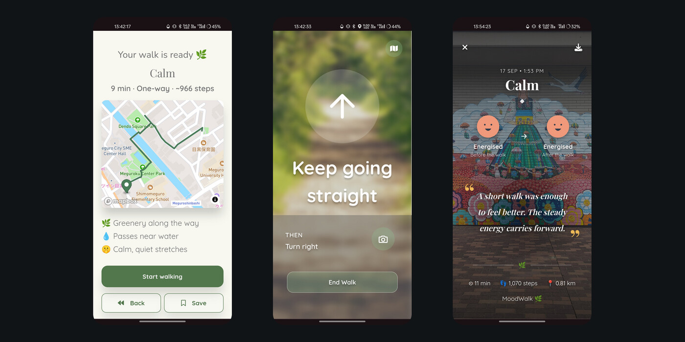
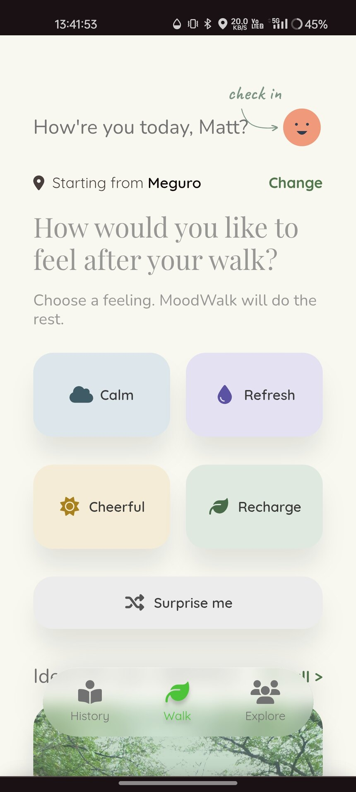
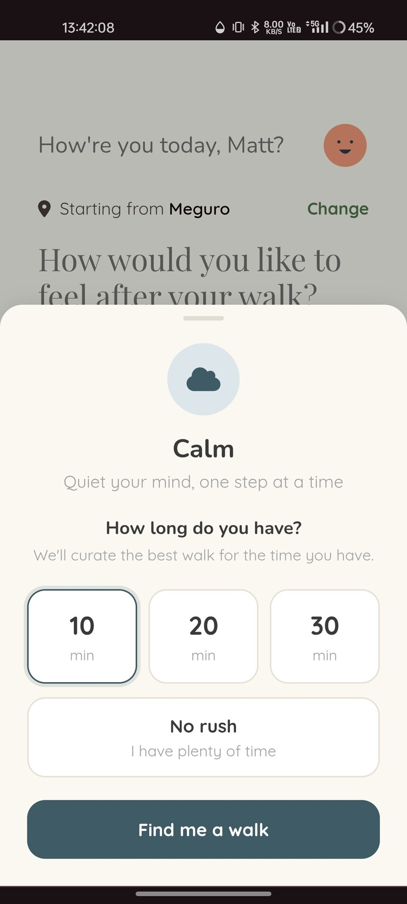
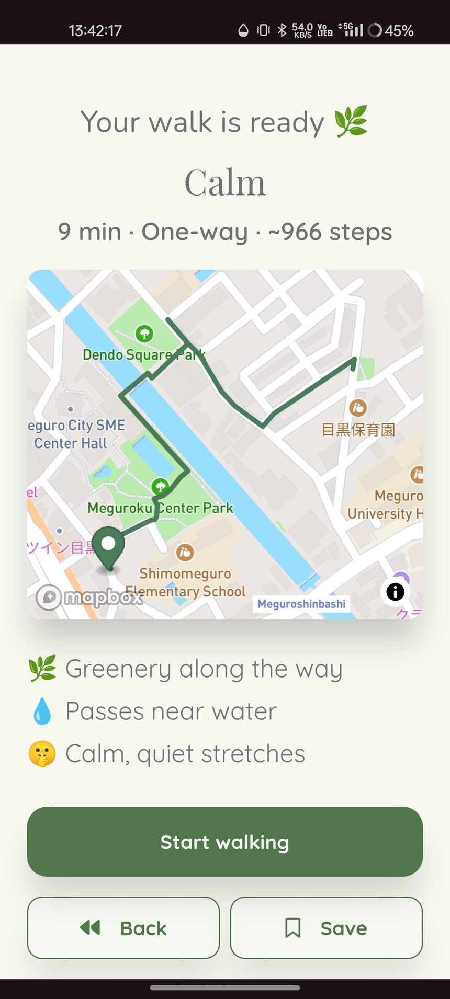
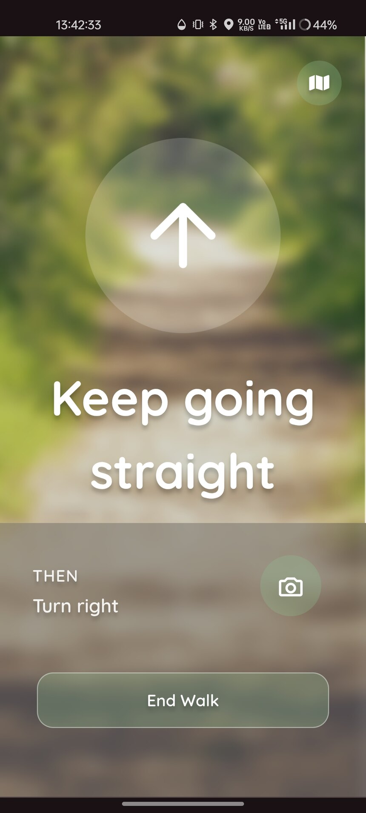
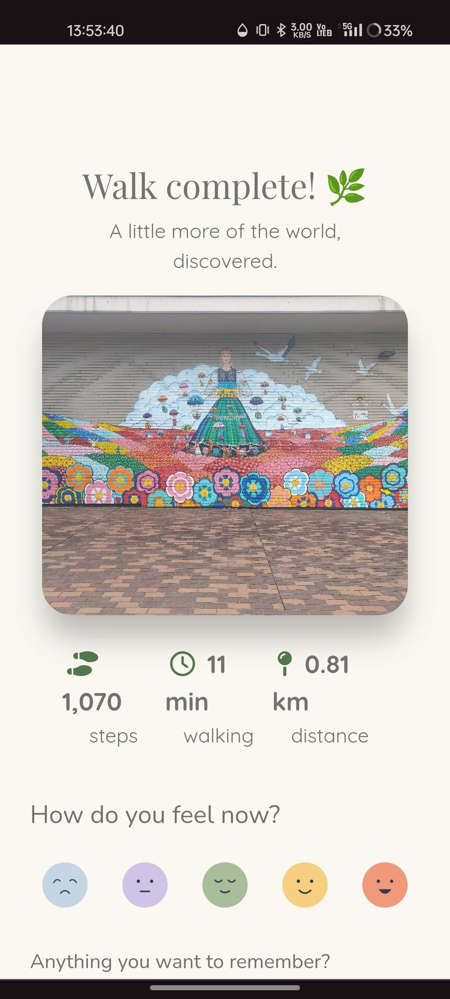
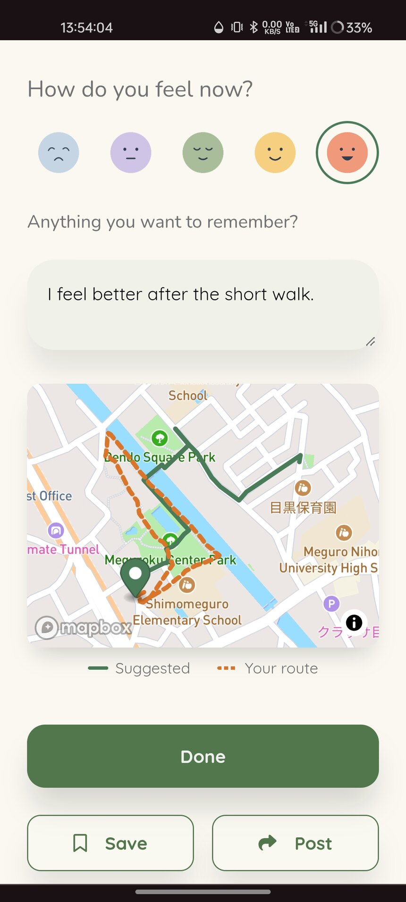
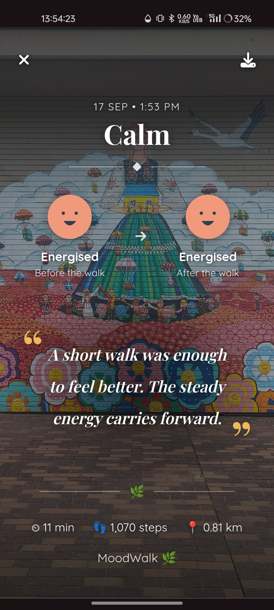

# 🌿 Moodwalk

Most navigation answers "how do I get to X". A walk you take to clear your head has no X.

Moodwalk invents the route instead. Tell it how you want to feel and how long you have, and it
builds a walk near you through real nearby places — a loop or a one-way trip, whichever the places
actually support — then guides you along it turn by turn and remembers how it went.



App home: https://moodwalk-ec6251edd332.herokuapp.com/

## One walk, end to end

Seven screens in order, photographed on a phone rather than staged in a browser. One walk in
Meguro, Tokyo: the route the app built that afternoon, the guidance that ran while it was walked,
and the mood and photo logged at the end of it.

| | | | |
|:-:|:-:|:-:|:-:|
|  |  |  |  |
| **1. Pick a feeling** <br> Decides which Google Places categories get searched near you. | **2. Say how long** <br> Becomes a target distance at the same pace handed to Mapbox. | **3. Get a route** <br> Nine minutes, one way, through Meguroku Center Park. | **4. Walk it** <br> Turn-by-turn from the route's own steps, with GPS breadcrumbs posted as you go. |

| | | |
|:-:|:-:|:-:|
|  |  |  |
| **5. Finish** <br> Distance, duration and steps read off the breadcrumb trail, not off the plan. | **6. Reflect** <br> The route walked, drawn against the route suggested. | **7. Keep it** <br> Mood before and after, and a line written from what you wrote. |

## What it does

**Before the walk**
- Pick a theme and a duration; Moodwalk finds real places nearby that fit and routes a walk through
  2–4 of them along actual streets
- Loop or one-way is decided by where the places are, not by a coin flip — waypoints clustered in
  one direction would make a "loop" that just retraces itself, so those become one-way trips
- Each route gets a name, a written description and a list of highlights
- Browse **community routes** other people have walked and shared, or save one for later

**During the walk**
- Turn-by-turn guidance from the route's own steps, driven by the phone's GPS
- Breadcrumbs are recorded as you go, so the path you actually took can be drawn against the one
  that was suggested
- A live step count

**After the walk**
- Log your mood before and after, write a reflection, rate the walk
- Attach a photo, pinned to where it was taken
- Share the walk to the community feed, with a generated quote to go with it
- Every walk is kept in your history with its distance, duration and step count

## Getting Started
### Setup

Install gems
```
bundle install
```

### ENV Variables
Create `.env` file
```
touch .env
```
Inside `.env`, set these variables. For any API keys, see group Slack channel.
```
MAPBOX_ACCESS_TOKEN=your_mapbox_access_token
GOOGLE_PLACES_API_KEY=your_google_places_api_key
CLOUDINARY_URL=your_own_cloudinary_url_key
GEMINI_API_KEYS=your_gemini_api_key
```
`GEMINI_API_KEYS` takes a comma-separated list — route descriptions fall through to the next key
when one runs out of quota. A single key is fine. `GEMINI_API_KEY` (singular) is read as a fallback.

### DB Setup
This app uses PostgreSQL with the PostGIS extension (needed for location/map data) — make sure PostGIS is installed before running this.
```
rails db:create
rails db:migrate
rails db:seed
```

### Run a server
```
rails s
```
(or `bin/dev`, which this repo also has set up as a shortcut for the same thing)

## Built With
- [Rails 8](https://guides.rubyonrails.org/) - Backend / Front-end
- [Stimulus JS](https://stimulus.hotwired.dev/) - Front-end JS
- [Heroku](https://heroku.com/) - Deployment
- [PostgreSQL + PostGIS](https://postgis.net/) - Database
- [Bootstrap](https://getbootstrap.com/) — Styling
- [Mapbox](https://www.mapbox.com/) — Maps, walking directions, geocoding
- [Google Places API](https://developers.google.com/maps/documentation/places/web-service) — Finding real nearby places for each route
- [RubyLLM](https://rubyllm.com/) + [Gemini](https://ai.google.dev/) — Route descriptions, highlights and share quotes
- [Solid Queue](https://github.com/rails/solid_queue) — Running those LLM calls off the request
- [Cloudinary](https://cloudinary.com/) — Active Storage backend for walk photos

## Acknowledgements

Inspired by the walks we take when we don't really know where we want to go — only how we hope to feel when we come back.

MoodWalk explores a different relationship with navigation: less about the fastest way from A to B, and more about slowing down, wandering, noticing, and rediscovering the world around us.

## Team Members
- [Matthew Hardcastle](https://www.linkedin.com/in/matthew-hardcastle-7762123aa/)
- [Twinky Hung](https://www.linkedin.com/in/twinky-hung/)
- [Yusuke Kamihanawa](https://www.linkedin.com/in/cura-yjk/)

## Contributing
Pull requests are welcome. For major changes, please open an issue first to discuss what you would like to change. See [`CLAUDE.md`](CLAUDE.md) for more in-depth technical notes about the codebase.

## License
This project is licensed under the MIT License
